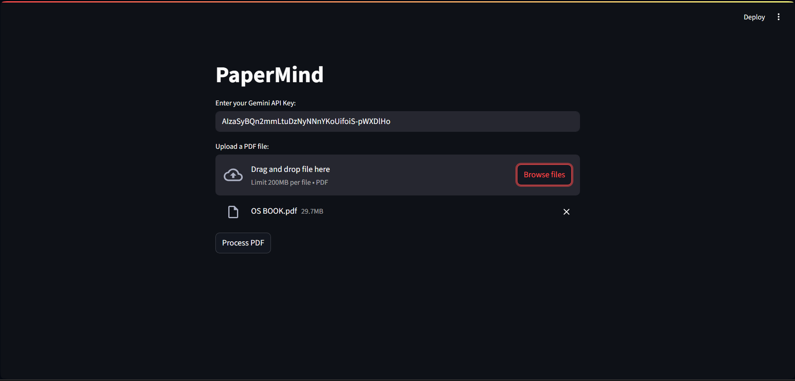

# PaperMind
Upload any PDF and ask questions—PaperMind finds answers from your document instantly! 

## Setup Instructions

1. **Clone this repository**
   ```sh
   git clone https://github.com/VijayarajParamasivam/PaperMind.git
   cd PaperMind
   ```

2. **Install Python 3.8+**
   
   Make sure Python is installed and available in your PATH.

4. **Create and activate a virtual environment**
   ```sh
   python -m venv venv
   venv\Scripts\activate
   ```

5. **Install dependencies**
   ```sh
   pip install -r requirements.txt
   ```

6. **Run the app**
   ```sh
   streamlit run app.py
   ```

7. **Open in your browser**
   
   Go to the URL shown in the terminal (usually http://localhost:8501).

---

## Get your Gemini API key

- [Get your Gemini API key here](https://aistudio.google.com/apikey)

---

Enjoy chatting

**ScreenShots**

<p align="center">
  
  &nbsp;
  
</p>

